## 들어가며

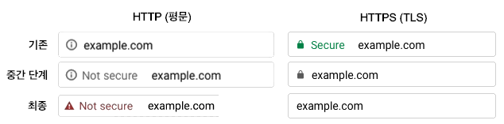

  인터넷, 특히 웹에서 사용하는 통신 프로토콜을 HTTP라고 하고, 보안 채널인 TLS를 사용하는 프로토콜을 HTTPS라고 합니다. 2018년, 파이어폭스와 크롬은 그동안 일반적인 통신 방법으로 사용하던 HTTP를 ‘안전하지 않음’으로 표시하기로 하였습니다. 크롬은 이에 더해서 ‘안전함'으로 표시하던 HTTPS를 점진적으로 특별한 표시를 제거하여 일반 사이트로 표시하기로 하였습니다. 이러한 변화는 보안 채널인 TLS가 더는 특별한 것이 아니라, 일반적이고 평범하며, 그리고 항상 적용되어야 함을 시사하고 있습니다.
  TLS는 서로 멀리 떨어진 두 컴퓨터가 안전하지 않은 네트워크를 통해서 안전하게 대화를 주고받기 위해 만들어진 보안 프로토콜입니다. 각종 사이트에 로그인할 때 입력한 로그인 정보부터 여러분이 인터넷 결제를 할 때 입력하는 정보까지, 묵묵히 그리고 안전하게 우리의 중요한 통신들을 보호해주던 TLS는 이제 ‘당연한 것'이 되었으며, 작년 8월 10일에는 드디어 새로운 버전인 TLS 1.3이 발표되었습니다. 오늘은 이제는 ‘당연한 것'이 되어 버린 TLS와 최신 버전인 TLS 1.3에 대해서 살펴보도록 하겠습니다.

## TLS 알아보기

  이 글의 앞부분은 TLS에 대해 잘 모르실 분들을 위해서 TLS의 필요성과 TLS의 기본 원리 등에 대해서 살펴봅니다. TLS에 대해 이해하고 있으며, TLS 1.3에 대해서만 파악하고 싶으신 분은 이 부분을 넘어가서 TLS 1.3 부분을 보셔도 좋습니다. 물론, TLS 1.3에 대해 정확하고 자세하게 알 방법은 [RFC 8446 표준 문서](https://tools.ietf.org/html/rfc8446)를 읽는 것입니다.

### 안전하지 않은 인터넷

  TLS라는 보안 프로토콜이 필요한 이유는 인터넷에서 데이터를 전달하는 방식이 안전하지 않기 때문입니다. 인터넷에서 데이터를 전달하는 방식은 ‘수업 시간에 쪽지를 보냈던 경험’을 떠올려보면 좋습니다. 수업 시간에 멀리 떨어진 친구에게 쪽지를 보낼 때는 직접 전달할 수 없기 때문에 중간에 있는 친구들의 도움을 받아야 합니다. 인터넷에서도 마찬가지로, 발신자인 클라이언트와 수신자인 서버는 직접 연결되지 않기 때문에 그 중간에 존재하는 무수한 전달자인 라우터가 데이터를 넘겨주는 방식으로 전달됩니다. 문제는 중간에 있는 라우터를 신뢰할 수 없다는 점에서 발생합니다.

### TLS의 보안 목표
  신뢰할 수 없는 라우터들로 인해서 어떤 문제들이 생길 수 있을까요? 수업 시간으로 다시 돌아가서 생각해보면 매우 간단하게 답을 생각할 수 있습니다. 여러분은 아마도 친구에게 전달하기 전에 쪽지를 접었을 것입니다. 그 이유로는 쉽게 전달하기 위한 것도 있겠지만, 중간에 있는 친구들은 열어보지 않기를 바라는 마음도 있었을 것입니다. 그렇기 때문에 보통은 메시지가 보이지 않는 방향으로 쪽지를 접습니다. 여러분은 최소한의 보안을 위해서 쪽지를 접었습니다만, 안타깝게도 여러분의 친구들은 믿을 수 없습니다.
  
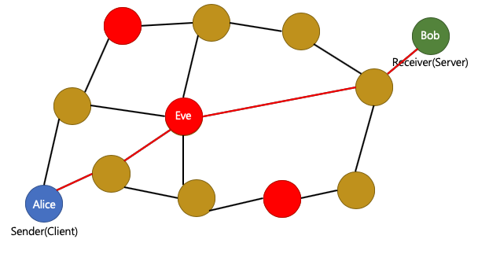
  설명하기 편하게 이름을 붙여보겠습니다. A에서 따온 이름을 가진 앨리스(Alice)는 자신의 친구, B에서 따온 이름을 가진 밥(Bob)에게 쪽지를 전하려고 합니다. 그 중간에서, 도청자(Eavesdrop)의 E에서 따온 이름을 가진 이브(Eve)라는 친구가 나쁜 마음을 먹었습니다. 이브는 쪽지가 자신에게 오기만 한다면 이를 열어볼 수도 있고, 앨리스에게 응답을 보내서 밥인 것처럼 속일 수도 있고, 아니면 쪽지의 내용을 지우개로 살짝 지우고 단어 몇 개를 바꿔서 밥에게 전달할 수 있습니다. 쪽지가 자신에게 오지 않는 경우를 대비해서, 주변의 자신과 친한 빨간 친구들과 모의할 수도 있습니다. 이러한 공격을 중간자 공격(Man-in-the-Middle Attack)이라고 합니다. 중간에 있는 믿을 수 없는 친구들 때문에 발생하는 문제입니다. 이제 TLS의 목표를 좀 더 이해하기 쉽게 말할 수 있습니다. 앨리스와 밥이 주고받는 쪽지를 이브가 방해할 수 없게 하는 것입니다. 한편, 앞에서 말씀드렸던 이브의 공격 방법을 3가지로 정리할 수 있습니다.
  
* 이브는 앨리스에게 응답을 보내서 자신을 밥이라고 속일 수 있습니다.
* 이브는 앨리스가 보낸 쪽지를 읽을 수 있습니다.
* 이브는 앨리스가 보낸 쪽지를 변경하거나, 위조할 수 있습니다.

그리고 이 세 가지 보안 위협에 대응하기 위한 다음의 보안 목표를 세울 수 있습니다.

* 인증성 (Authenticity): 앨리스와 쪽지를 주고받는 상대방이 밥임을 인증하는 것
* 기밀성 (Confidentiality): 앨리스와 밥 만이 서로의 쪽지를 읽을 수 있고, 이브는 불가능하게 하는 것
* 무결성 (Integrity): 앨리스가 쓴 쪽지가 변경되지 않았음을 보장하는 것

TLS는 이 세 가지 보안 목표를 달성함으로써, 안전하지 않은 인터넷에서 안전한 통신 채널을 만들 수 있습니다.

### TLS의 암호화 모음 (Cipher Suite)

  TLS는 안전한 네트워크 연결을 위해서 앞에서 언급했던 각각의 보안 목표를 달성하는 암호화 기법을 여러 가지 조합하여 암호화 모음을 만들었습니다. 클라이언트와 서버는 적절한 암호화 모음을 선택하기만 하면, 세 가지의 보안 목표를 달성할 수 있습니다. 암호화 모음은 구별을 위해서 이름을 가지고 있는데, 암호화 모음의 이름은 일반적으로 다음과 같은 구조를 가집니다.

TLS_{키 합의 프로토콜}_{인증 방법}_WITH_{암호화 기법}_{데이터 무결성 체크 방법}

  예를 들어서 TLS_DHE_RSA_WITH_AES_256_CBC_SHA256의 경우, 키 합의 프로토콜으로는 DHE, 인증 방법으로는 RSA, 암호화 기법으로는 AES_256_CBC, 데이터 무결성 체크 방법으로는 SHA256를 사용하는 것을 알 수 있습니다. 그리고 색깔로 구별해드린 것에서 눈치채셨겠지만 인증 방법은 인증성을, 암호화 기법은 기밀성을, 데이터 무결성 체크 방법은 무결성을 담당합니다.

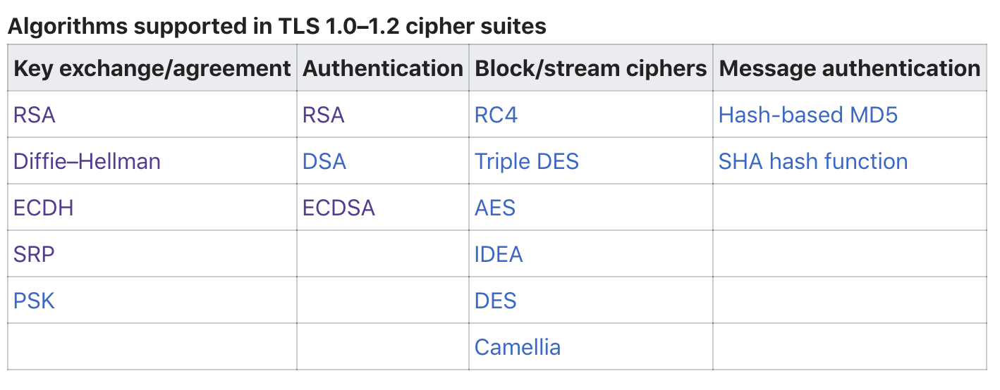
  위 그림은 위키피디아에 정리된 TLS가 지원하는 암호화 모음의 목록입니다. 각 항목의 조합으로 정말 많은 암호화 모음을 만들어서 지원하고 있습니다. [TLS1.2를 정의한 RFC5286의 appendix-C](https://tools.ietf.org/html/rfc5246#appendix-C)나 [IANA가 정의한 TLS의 표준 암호화 모음 페이지](https://www.iana.org/assignments/tls-parameters/tls-parameters.xhtml#tls-parameters-4)에서 더 자세한 목록을 확인할 수 있습니다.

### 암호 기본 요소 (Cryptographic Primitives)

앞서 살펴봤던 암호화 모음은 여러 구성 요소로 이루어져 있었습니다. 마치 레고 작품을 완성하기 위한 레고 조각 같은 이러한 작은 알고리즘을 암호 기본 요소라고 부릅니다. 대표적으로는 대칭키 암호화, 비대칭키 암호화, 키 합의 프로토콜, 암호학적 해시 함수, 메시지 인증 코드 등이 있습니다. 이들이 어떻게 동작하는지 알아보고, 어떤 보안 목표를 달성할 수 있는지 생각해보면, TLS를 더 잘 이해할 수 있을 것입니다.

#### 대칭키 암호화

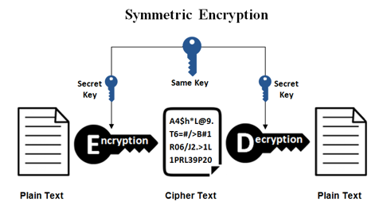
  우선 암호화 과정에서 자주 쓰이는 용어들에 대해서 정리하겠습니다. 전송할 원본 메시지를 평문(plain text), 이를 아무도 읽지 못하게 암호화한 것을 암호문(cipher text)이라고 합니다. 그리고 평문을 암호문으로 바꾸는 과정을 암호화(encryption), 암호문을 평문으로 해독하는 과정을 복호화(decryption)라고 합니다. 이 두 과정에는 다양한 수학적 기법들이 사용됩니다. 암호화/복호화 과정에는 항상 키(key)라는 특수한 데이터가 존재합니다. 이 키가 있어야만 암호화/복호화를 올바르게 수행할 수 있기 때문에, 키는 항상 안전하게 보관해야 합니다. 이름에서 유추할 수 있지만, 금고의 열쇠 같은 역할이라고 생각하면 좋습니다.
  대칭키 암호화는 암호화를 하는데 사용하는 키와 복호화를 하는데 사용하는 키가 같은 암호화를 말합니다. 즉 앨리스와 밥은 공통의 키를 만들어두고 이브에게 키를 공개하지 않고 잘 보관하면 안전하게 메시지를 주고받을 수 있습니다. 대칭키 암호화는 수행 속도가 빠르다는 장점이 있고, 키를 아는 사람만 암호화/복호화를 할 수 있다는 점에서 기밀성을, 그리고 단 둘만 키를 가지고 있다면 그 자체로도 약간의 인증성을 제공할 수 있습니다. 대표적인 기법으로는 많이 들어보셨을 AES, 그리고 공인인증서의 암호화 방식으로 유명한 SEED, ARIA, 최근에 주목받고 있는 암호인 ChaCha20 등이 있습니다. 그런데 이 방식에는 한 가지 문제점이 있습니다. 멀리 떨어져 있는 두 대상이 안전하지 않은 네트워크를 사이에 두고 어떻게 같은 키를 공유할 것인가가 바로 그 문제입니다. 이에 대한 해결책은 이후 키 합의 프로토콜에서 살펴보도록 하겠습니다.

#### 비대칭키 암호화

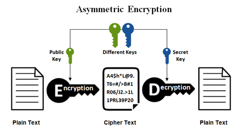
  비대칭키 암호화는 암호화 단계에 사용하는 키와 복호화 단계에 사용하는 키가 다른 암호화를 말합니다. 키는 한 쌍으로 구성되는데, 하나의 키로 암호화한 것은 다른 한쪽의 키로만 복호화할 수 있습니다. 일반적으로 하나는 안전하게 보관하는 개인 키로, 하나는 누구나 가질 수 있게 공개하는 공개 키로 사용합니다. 이 기법은 특정 공개 키에 대한 개인 키의 소유를 증명할 수 있다는 점에서 인증성을 보장해주고, 실제 암호화에 사용할 세션 키를 안전하지 않은 채널을 통해 교환하는 방법으로 사용할 수 있습니다. 공개 키로 암호화한 것은 개인 키를 이용해야만 복호화가 가능하다는 점에서 단방향으로 기밀성을 보장하지만, 암호화/복호화에 드는 비용이 크기 때문에 일반적인 암호화 통신에는 대칭키 암호화를 사용합니다. 대표적인 암호로는 RSA나 DSA가 있습니다.

#### 디지털 인증서

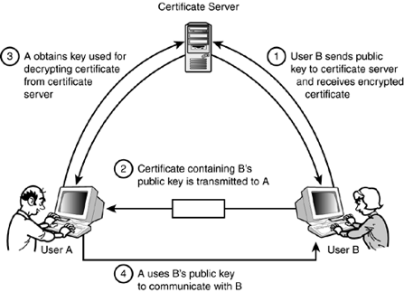
  TLS에서는 ‘상대방이 통신하고자 하는 대상이 맞음'을 인증하기 위해서 디지털 인증서를 사용합니다. 디지털 인증서는 모두가 신뢰할 수 있는 제삼자인 CA와 비대칭키 암호화이 필요합니다. 밥은 우선 CA에게 자신이 밥임을 다양한 방식으로 증명하고 자신의 공개 키가 밥의 공개 키가 맞음을 인증하는 인증서를 발급받습니다. 이후 앨리스에게 이 인증서를 주면, 앨리스는 자신이 신뢰할 수 있는 CA가 발급한 올바른 인증서인지 확인하고, 맞으면 그 인증서에 포함된 밥의 공개 키로 데이터를 암호화해서 전달합니다. 만약 밥이 이것을 올바르게 복호화한다면 CA가 인증하는 밥의 공개 키에 대응하는 개인 키를 가지고 있다는 것이므로, 이 과정을 통해서 현재 통신하고 있는 상대방이 밥이 맞음을 인증할 수 있습니다. 

#### 키 합의 프로토콜

  대칭키 암호화를 사용하기 위해서는 안전하지 않은 네트워크상에서 안전하게 키를 교환할 수 있어야 합니다. 이러한 역할을 하는 알고리즘을 key exchange, key agreement, key establishment 등 여러 이름으로 부릅니다. 여기서는 ‘키 합의 프로토콜'이라고 하겠습니다. 크게 두 가지 방법이 있는데, 하나는 앞서 살펴보았던 비대칭키 암호화 중 대표적인 RSA를 기반으로 한 프로토콜이고, 다른 하나는 디피-헬만 키 합의 프로토콜입니다.

#### RSA 키 합의 프로토콜

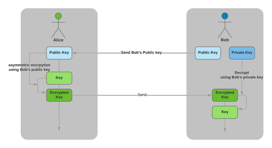
  먼저, 비대칭키 암호화인 RSA를 사용한 키 합의 프로토콜부터 살펴보겠습니다. 앨리스가 밥의 공개 키를 알고 있기 때문에, 앨리스는 앞으로 둘의 통신에 사용할 세션 키를 만들어서 이를 밥의 공개 키로 암호화한 다음 밥에게 전송합니다. 이를 복호화할 수 있는 개인 키를 가지고 있는 사람은 밥 뿐이므로, 제 3자인 이브는 세션 키를 얻을 수 없고, 앨리스와 밥은 안전하게 세션 키를 교환하여 보안 채널을 만들 수 있습니다. 그런데 겉보기에는 안전해보이는 이 방식에는 새로운 보안 문제가 있습니다.
  
#### 순방향 비밀성 (Forward Secrecy)

  밥의 개인 키를 모르는 이브는 우선 둘의 모든 통신을 기록해두기로 합니다. 왜냐하면 언제가 될지는 모르지만, 밥의 개인 키를 알아내기만 하면 그동안 기록해 둔 것을 복호화해서 앨리스가 밥에게 보낸 세션 키를 얻을 수 있고, 세션 키를 얻으면 둘의 대화 내용을 알아낼 수 있기 때문입니다. 실제로, 밥이 가지고 있는 개인 키는 언제든 어떤 이유로 인해 유출될 수 있습니다. 예를 들어, 2014년에 세상을 떠들썩하게 했던 [Heartbleed 버그(CVE-2014-0160)](http://heartbleed.com/)가 있습니다.

  이 버그는 OpenSSL 구현의 취약점으로, 공격자가 서버의 메모리상에 존재하지만 허가되지 않은 데이터를 얻을 수 있게 합니다. 이러한 방법이든 아니면 또 다른 방법이든 밥의 개인 키가 유출되고 나면, 앨리스와 밥의 통신은 개인 키가 유출되기 전에 이루어진 것이더라도 안전하지 않게 됩니다. 이와 같은 상황에 대비하여, 현재에만 안전한 것이 아니라 미래에 개인 키가 유출되어도 안전하게 하는 보안 목표를 순방향 비밀성 (forward secrecy), 또는 완전 순방향 비밀성 (perfect forward secrecy, PFS)이라고 합니다. 우리가 살펴보았던 RSA 기반의 키 합의 프로토콜은 순방향 비밀성을 제공하지 않음을 알 수 있습니다. 이제 순방향 비밀성을 제공하는 키 합의 프로토콜에 대해서 알아볼 차례입니다.

#### 디피-헬만(-머클) 키 합의 프로토콜 (Diffie-Hellman(-Merkel) Key Exchange, DHM, DH)

  디피-헬만 키 합의 프로토콜이라고 알려진 위대한 기법을 소개할 순서입니다. 기본 아이디어를 제공한 머클의 공로를 인정하여 디피-헬만-머클 키 합의 프로토콜으로 불러야 한다거나, 아니면 공로의 크기에 따라 [머클-디피-헬만으로 불러야 한다는 의견](https://xtendo.org/ko/mdh)이 있는 이 기법은 안전하지 않은 채널에서 안전하게 세션 키를 만들 수 있게 하며, 순방향 비밀성도 보장합니다. 이것이 가능한 이유는 네트워크를 통해 세션 키를 전달하는 것이 아니라, 세션 키를 만들 수 있는 힌트만을 네트워크상으로 전달하기 때문입니다. 위키피디아에서 가져온 아래 그림을 보시면 조금 더 쉽게 이해할 수 있습니다.
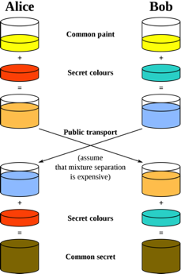
  위 그림에서는 키를 색에 비유해서 설명하고 있습니다. 목표는 앨리스와 밥이 안전하지 않은 통신을 통해서 공통의 색을 만드는 것입니다. 여기에는 가정이 하나 있는데, 색깔의 혼합은 일방향함수라는 것입니다. 풀어서 설명하면, 두 색을 섞어서 새로운 색을 만들기는 쉽지만, 섞여 있는 색을 두 개의 원래 색으로 분리하는 것은 어렵다는 것입니다. 우선 앨리스와 밥은 이번 통신에 사용할 기저 색을 공개적으로 정합니다. 이 그림에서는 노란색입니다. 그 후 앨리스는 빨간색, 밥은 청록색을 비밀 색으로 정했습니다. 둘 다 직접 비밀 색을 전송하지 않고, 기저 색인 노란색과 각자의 비밀 색을 섞은 결과인 오렌지색과 파란색을 전송합니다. 앨리스와 밥은 각자 받은 것을 자신의 비밀 색과 섞으면 공통의 색을 만들 수 있습니다. 하지만 이브는 기저 색과 주황색, 파란색을 가지고도 가정에 의해서 공통의 색을 만들어낼 수 없습니다. 이브가 훗날 어느 쪽이든 비밀 색을 알아내면 공통 색을 만들 수 있기 때문에, 앨리스와 밥은 더는 필요 없는 비밀 색인 빨간색과 청록색을 버립니다. 이러한 방식을 수학적으로 구현한 것이 디피-헬만 키 합의 프로토콜으로, 실제로는 이산 로그 문제라는 것을 이용해서 일방향함수를 만들어 사용합니다. 이러한 방식으로 키를 교환하면, 둘의 통신을 기록해두고 훗날 밥의 개인 키를 탈취하더라도 얻을 수 있는 것은 힌트뿐이므로 여전히 복호화를 할 수 없습니다. 그리고 세션 키를 만드는 데에 사용한 비밀 키들은 폐기되었기 때문에, 탈취할 수 없습니다. 짧게 요약하면, 디피-헬만 키 합의 프로토콜은 순방향 비밀성을 제공합니다.

#### 무결성
  데이터의 무결성을 제공하기 위한 암호 기본 요소에는 해시 함수(hash function)와 키 있는 해시 함수(keyed hash function)가 있습니다.
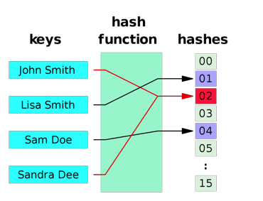
  해시 함수는 어떤 임의의 데이터를 입력으로 받아서 일정한 길이의 데이터로 바꾸어주는 함수를 말하는데, 이때 나오는 결과인 일정한 길이의 데이터를 해시 또는 해시 값이라고 합니다. 이 중에서도 암호학적으로 강점을 가지는 요소들을 가진 해시 함수들을 암호학적 해시 함수라고 합니다. 암호학적으로 강점을 가지는 요소에는 첫째, 해시 값만을 보고서 입력 데이터를 찾기 어려울 것, 둘째, 특정 입력 데이터의 해시 값과 같은 해시 값을 가지는 다른 데이터를 찾기 어려울 것, 셋째, 같은 해시 값을 가지는 서로 다른 두 입력 데이터를 찾기 어려울 것이 있습니다. 이러한 조건들을 만족하는 대표적인 암호학적 해시 함수로는 SHA-256이 있습니다. 암호학적 해시 함수들은 이러한 특성들 덕분에 데이터의 무결성을 보장하는 데에 사용할 수 있습니다. 예를 들어서 특정 메시지에 해시 값을 이어붙여서 전송하면, 전송 중에 메시지가 변경되었을 경우 해시 값이 다르다는 점을 통해서 오염된 메시지임을 알 수 있습니다. 하지만 완벽한 무결성을 제공하지는 못합니다. 왜냐하면 이브도 아무 데이터에 대해서 올바른 해시 값을 계산할 수 있기 때문입니다. 이브가 메시지의 본문을 바꾼 후, 해시 값도 변경된 데이터에 알맞은 것으로 변경하는 방식으로 위조(forgery attack)하면 밥은 지금 받은 데이터가 앨리스가 보낸 데이터가 맞는지 아니면 변경된 것인지 알 수 없습니다. 키 있는 해시 함수는 이러한 문제를 해결할 수 있습니다.
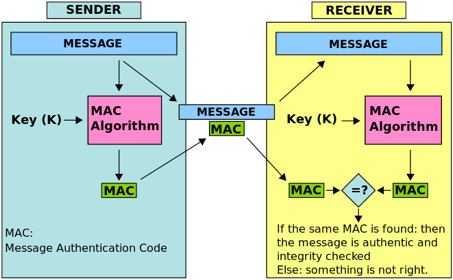
  키 있는 해시 함수에도 여러 가지 종류가 있는데, 우리가 살펴볼 것은 메시지 인증 코드(message authentication code, MAC)입니다. 메시지 인증 코드는 대칭키 암호화의 개념과 해시 함수를 섞은 형태라고 생각하면 쉽게 이해할 수 있습니다. 키에 따라서 메시지를 넣었을 때 나오는 해시 값이 달라지는 것이 특징입니다. 따라서 키를 모르는 이브는 메시지를 변경하고 그에 맞는 해시 값을 계산하여 붙이려고 해도 올바른 해시 값을 계산할 수 없으므로, 위조나 변조를 할 수 없습니다. 앨리스와 밥은 공통의 키를 가지고 있기 때문에, 같은 해시 값을 계산해 낼 수 있습니다. 키를 알고 있는 사람만이 올바른 해시 값을 만들 수 있다는 점에서 앨리스가 보낸 메시지가 변조되지 않았다는 무결성을 보장할 수 있으며, 해당 해시를 계산하는데 사용할 키를 가지고 있음을 증명하기 때문에 약한 인증성도 제공합니다. 메시지 인증 코드에는 대표적으로 HMAC, CMAC, Poly1305, SipHash가 있습니다. 참고로, python 3.x에서는 2.x 버전과 다르게 해시 함수로 siphash를 사용하기 때문에 실행할 때마다 키가 바뀌어서 사전의 항목 순서가 매번 바뀌게 됩니다.

### TLS 1.2 핸드셰이크 (Handshake)

  암호화 모음을 구성하는 암호 기본 요소에 대해서 모두 알아보았습니다. 이제 TLS에서 어떻게 이러한 것들을 준비하는지 알아보도록 하겠습니다. TLS에서 보안 채널을 만들기 위해 실제 데이터를 보내기 전에 서로 합의하며 준비하는 과정을 핸드셰이크라고 합니다. 이 과정에서는 어떤 것들을 합의하고 준비해야 할까요? 우선 나와 지금 핸드셰이크를 시작할 상대방의 신원을 파악해야 합니다. 신원이 파악이 안 되면 다른 것들을 합의하는 것은 의미가 없을 것입니다. 그다음 할 일은 양쪽이 지원하는 암호화 모음을 살펴보고, 가장 적절한 것을 하나 골라야 합니다. 그다음으로 해당 암호화 모음을 사용하기 위해서 필요한 각종 파라미터를 합의하고, 세션 키를 만들면, TLS 보안 채널이 완성됩니다. 마지막으로 만들어진 TLS 보안 채널을 통해서 암호화/복호화를 진행하면서 데이터를 주고받으면 됩니다. 이 과정이 핸드셰이크에서 이루어지는 것들이고, 아래는 간략하게 나타낸 TLS 1.2의 핸드셰이크 과정입니다.
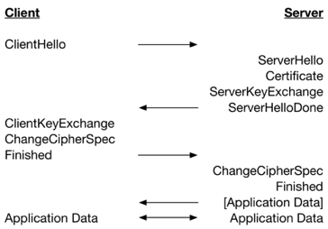
  ClientHello에서 클라이언트는 자신이 사용할 TLS 버전, 사용 가능한 암호화 모음 등을 서버에 보냅니다. 서버는 그중에서 암호화 모음 하나를 선택해서 ServerHello에 기입하고 자신의 인증서와 함께 클라이언트에 보냅니다. 클라이언트는 서버의 인증서를 평가한 후, ClientKeyExchange에 세션 키를 만들어서 서버의 공개 키로 암호화해서 전달합니다. ChangeCipherSpec은 이후 보내는 모든 메시지는 암호화될 것임을 상대에 알리는 용도입니다.

  지금까지, TLS의 필요성에 대해 살펴보고, TLS의 보안 목표와 이들을 달성할 수 있게 한 기본 암호 모음, 그리고 TLS 1.2의 핸드셰이크까지 살펴보았습니다. 이제부터 최신 버전인 TLS 1.3에서는 어떤 것들이 바뀌었는지 살펴봅시다.

## TLS 1.3
  TLS 1.3이 개선한 것들을 정리해보면 크게 속도와 정리 그리고 보안으로 요약할 수 있습니다.

### TLS 1.3의 속도
  TLS 1.3은 RTT를 줄여서 속도를 개선하였습니다. RTT는 round trip time을 말하는 것으로, 어떤 데이터를 상대방에게 보내기 시작한 시간부터 그것에 대한 응답을 받기 시작하는 시간까지, 즉 데이터가 네트워크를 한 바퀴 돌아서 다시 돌아오는데 걸리는 시간을 말합니다. TLS는 보안 채널을 구성하기 위해서 핸드셰이크 과정이 필요한데, 이 과정에서 많은 시간이 소요됩니다. 핸드셰이크는 크게 처음 연결하는 경우와 기존에 연결했던 것을 다시 연결하고자 하는 경우가 있는데요, TLS 1.3는 기존과 비교해서 각각 1 RTT만큼을 줄였습니다. 구체적으로는 처음 연결 시 1-RTT가 소요되고, 다시 연결 시에는 0-RTT를 시범적으로 지원합니다.
  
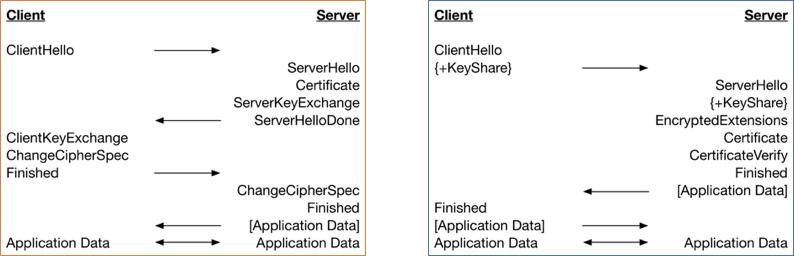
  왼쪽은 TLS 1.2의 핸드셰이크, 오른쪽은 TLS 1.3의 핸드셰이크를 정리한 것입니다. 왼쪽은 클라이언트-서버-클라이언트-서버의 2 RTT 후에 암호화된 데이터가 송수신되는 것을 볼 수 있지만, 오른쪽은 클라이언트-서버의 1 RTT 후에 Finished와 암호화된 데이터가 같이 전달되는 것을 확인할 수 있습니다.

### TLS 1.3의 정리
#### 암호화 모음 관리 단순화
  TLS 1.3에서는 기존의 암호화 모음 관리 방법이 가지던 복잡성을 줄이기 위해서 암호화 모음을 3개의 요소로 분리하고, 이를 조합하는 형태로 바꾸었습니다. 아래 그림을 보면서 설명을 하겠습니다.
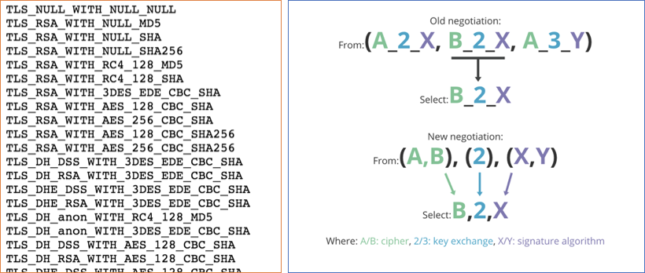
  왼쪽은 TLS 1.2에서 지원하던 암호화 모음의 목록을 일부 가져온 것이고, 오른쪽은 TLS 1.3에서 조합해서 쓰는 형태로 변경한 것을 나타냅니다. 왼쪽은 지원하는 모든 암호화 모음의 조합을 나열하고 있는데, 하나의 암호화 모음은 키 합의 프로토콜, 인증 알고리즘, 암호화 기법, 무결성 체크 기법을 모두 묶은 것으로 한 줄 한 줄에 대해서 구별이 되는 코드값을 부여하고 있습니다. 이러한 방식은 확장성이 매우 떨어지는데, 만약 키 합의 프로토콜에서 새로운 프로토콜이 추가된다면, 다른 모든 조합에 대해서 무수히 많은 새로운 항목을 만들어야 합니다. 이에 반해서 오른쪽 방법은 서로 구별이 되는 요소들인 암호화 기법, 키 합의 프로토콜, 인증 알고리즘으로 분리해서 나타내기 때문에 키 합의 프로토콜에 새로운 프로토콜이 추가되어도 가운데 항목에만 새로운 값을 부여하면 나머지 모든 조합도 자동으로 지원하게 됩니다. 실제 예시를 들어보면 기존에는 TLS\_ECDHE\_ECDSA\_WITH\_CHACHA20\_POLY1305\_SHA256라는 이름의 암호화 모음이 있었고, 이는 0xCCA9라는 값을 가지고 있었습니다. TLS 1.3부터는 <TLS\_CHACHA20\_POLY1305\_SHA256( 0x1303), x25519(0x001D), ecdsa\_secp521r1\_sha512(0x0603)>와 같이 세 요소의 조합으로 나타낼 수 있습니다.

### TLS 1.3의 보안

TLS 1.2까지는 기존과의 호환성을 위해 지원하던 legacy 기능이 많이 있었지만, 이러한 기능들은 오래된 것들이다 보니 시간이 지나서 보안에 위협이 되기도 했습니다. TLS 1.3에서는 보안을 강화하기 위해서, 기존의 TLS 1.2에서 지원하였던 많은 기능을 삭제하고 정리하였습니다. 주로 상대적으로 더 높은 보안 강도를 가지는 키 길이 (256bit), 짧은 길이로도 더 높은 보안 강도를 높이는 타원 곡선 암호, 미래에도 안전함을 보장하는 순방향 비밀성을 기준으로 선택한 것으로 보입니다. 어떤 항목들을 어떻게 정리하였는지 항목별로 살펴보겠습니다.

#### 순방향 비밀성을 고려한 키 합의 프로토콜

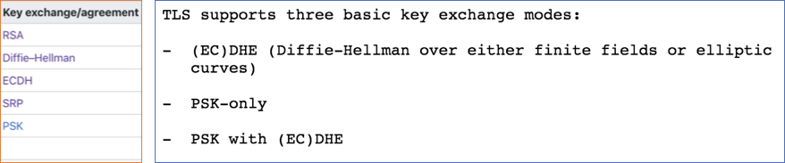
  왼쪽은 TLS1.2에서 지원하던 키 합의 프로토콜을 나타내고, 오른쪽은 TLS 1.3에서 지원하는 키 합의 프로토콜을 나타냅니다. TLS 1.3에서는 순방향 비밀성을 보장하지 않는 RSA 등의 다른 방법들은 제거되었고 (EC)DHE, PSK-only, PSK with (EC)DHE만 남았습니다. PSK는 미리 안전한 방법으로 공유된 키를 사용하는 방법인 사전 공유 키(pre-shared key)의 줄임말로, 엄밀히는 순방향 비밀성을 보장하지는 않습니다. PSK를 사용하면서 순방향 비밀성을 보장하고자 할 때는 PSK with (EC)DHE를 사용하면 됩니다.

#### 강한 기법들만 남은 서명 알고리즘

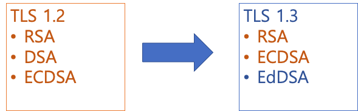
  서명 알고리즘에서도 변경이 있었습니다. TLS 1.2에서는 RSA, 디지털 서명 알고리즘(DSA), 타원곡선 디지털 서명 알고리즘(ECDSA)을 지원하고 있었습니다. 2048 bit의 키를 지원하는 RSA와 비교해서 1024 bit이라는 짧은 키를 강제하는 문제가 있었던 디지털 서명 알고리즘은 TLS 1.3에서 삭제되었습니다. 그리고 에드워드 곡선이라는 안전하다고 알려진 새로운 종류의 타원 곡선을 사용하는 에드워드 곡선 디지털 서명 알고리즘(EdDSA)이 추가되었습니다.

#### AEAD만 살아남은 암호화 모음

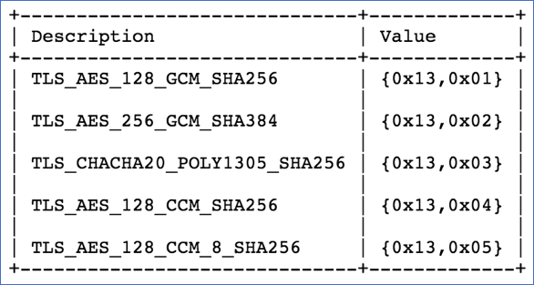
  TLS 1.3에서는 암호화 모음의 정의가 바뀌었습니다. 앞서 ‘암호화 모음 관리 단순화'에서 살펴봤습니다만, TLS 1.2에서 암호화 모음이라는 것은 보안 채널을 만드는데 필요한 모든 암호 기본 요소들의 조합으로, 키 합의 프로토콜, 인증 알고리즘, 암호화 기법, 무결성 체크 기법 등을 포함하는 묶음이었습니다. 하지만 TLS 1.3에서는 키 합의 프로토콜과 인증 알고리즘이 분리되었으므로, 암호화 모음은 암호화 기법과 무결성 체크 기법을 담당합니다. 위 그림은 TLS 1.3에서 지원하는 암호화 모음을 나타낸 것입니다. 기존의 무수히 많았던 것들이 모두 삭제되었고 위 그림의 5가지 암호화 모음이 새로 정의되었는데, 이름은 ‘TLS\_AEAD\_해시 함수’의 형태로 붙였습니다. 해시 함수는 키를 생성하기 위해 사용하는 것으로, SHA256 이상을 사용합니다. AEAD는 처음 들어보는데 무엇일까요?

##### 연관 자료가 있는 인증 암호화(Authenticated Encryption with Associated Data, AEAD)
  번역한 이름이 매우 길기 때문에, 이 글에서는 AEAD라고 쓰겠습니다. AEAD의 출발은 AE, 즉 인증 암호화입니다. 기존에는 암호화 기법과 무결성 체크 기법이 분리되어 있었는데, 여기에는 사소하지만 중요한 문제가 있었습니다. 바로 어떤 순서로 각 기법을 적용해야 할 것인가입니다. 암호화와 무결성 체크를 각각 한 다음에 합칠지(Encrypt-and-MAC), 암호화를 먼저 적용하고 무결성 체크를 할지(Encrypt-then-MAC), 무결성 체크를 먼저 하고 암호화를 할지(MAC-then-Encrypt)를 두고 의견이 분분했습니다. 그중 일부는 취약점이 발견되기도 하고, 방법 자체는 문제가 없으나 구현의 실수로 취약점이 생기기도 했습니다. 이러한 혼란을 막기 위해서, 인증 암호화라는 기법이 만들어졌습니다. 내부적으로 암호화와 인증을 올바르게 구현하였기 때문에 사용하는 사람은 쉽게 사용만 하면 됩니다. 연관 데이터(AD)는 무결성 체크에는 필요하지만 암호화할 필요는 없거나, 하면 안 되는 데이터를 말합니다. 예를 들어서 암호화된 패킷에 대한 메타 데이터인 헤더 같은 정보들은 위조는 막아야 하지만 암호화가 되면 안 되므로, 연관 데이터로 AEAD에 넣어주면, 헤더를 자유롭게 아무나 읽을 수 있지만, 헤더가 변경된 경우 감지할 수 있습니다. 대표적인 AEAD로는 AES\_GCM, CHACHA20\_POLY1305 등이 있습니다.

#### 핸드셰이크 전체에 대한 인증
  TLS 1.2는 다양한 오래된 기법들을 지원하고 있었기 때문에 [FREAK](https://nvd.nist.gov/vuln/detail/CVE-2015-0204)과 같이 중간에서 낡고 취약한 기법으로 보안 수준을 낮추는 공격에 당하기 쉬웠습니다. TLS 1.3에서는 이렇게 TLS의 헤더 값을 바꾸어서 취약한 기법으로 변경하는 것을 막기 위해서, 특히 첫 번째 핸드셰이크 패킷인 ClientHello에 대해서도 자신이 받은 데이터에 대해 인증하는 과정을 추가하였습니다.

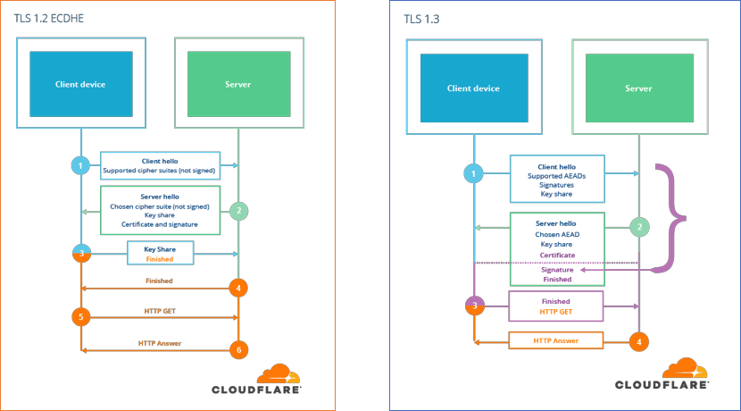
  위 그림을 보시면, TLS 1.2에서는 ClientHello에 대한 인증 절차가 없기 때문에 이브가 중간에서 헤더를 변경해서 취약한 암호화 기법만 쓰도록 하여도 서버나 클라이언트가 이를 눈치챌 방법이 없습니다. TLS 1.3에서는 서버는 ClientHello에 대해서 서명(signature)을 생성하여 ServerHello에 추가하여 클라이언트에 보냅니다. 클라이언트는 자신이 보낸 데이터로 생성한 서명과 서버가 보낸 서명을 비교하여 서버가 자신이 보낸 데이터를 변경 없이 올바르게 잘 받았는지 확인할 수 있습니다.

### 더 이른 단계부터 암호화 지원

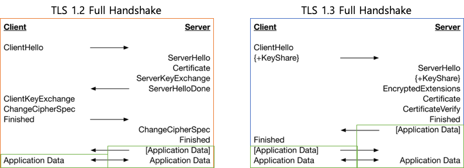
  TLS 1.3은 TLS 1.2와 비교해서 핸드셰이크 과정이 1-RTT로 줄었습니다. 이와 함께, 서버가 처음 보내는 패킷인 ServerHello부터 응용프로그램의 데이터를 암호화해서 전송할 수 있게 됩니다.

#### 타원 곡선 정리

  오늘날 주목을 받는 암호화 기법에는 타원 곡선 암호가 있습니다. 타원 곡선이라는 특수한 집합에서 수학적 연산을 정의하고, 그 정의 위에서 각종 암호화 기법을 구현한 것으로 이산 로그 문제의 한 종류입니다. 타원 곡선 암호는 기존의 소인수 분해의 어려움에 기반한 RSA와 비교했을 때, 키 길이 대비 더 높은 보안 수준을 제공하고, 더 빠르다는 장점이 있습니다. 예를 들어서 RSA로는 2048 bit의 키를 사용해서 얻을 수 있는 보안 수준보다 256 bit의 키를 사용한 타원 곡선 암호의 보안 수준이 훨씬 높으며, 연산 속도는 20배나 빠릅니다. 이러한 타원 곡선 암호는 높은 보안 수준을 가지는 안전한 타원 곡선을 선택하는 것이 중요합니다. 아래는 TLS 1.2와 TLS 1.3에서 지원하는 타원 곡선의 목록을 나타낸 것입니다.
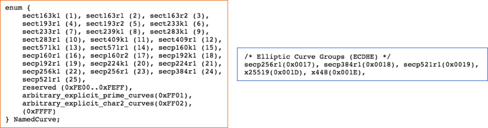
  기존에 존재하던 많은 타원 곡선들이 대부분 삭제되었고, 안전하다고 알려진 몇 가지 타원 곡선들만 남았습니다.

## TLS의 역사

  TLS에 대해서 전반적으로 살펴보았는데, TLS의 역사에 대해서 간단히 살펴보면 좋을 것 같습니다. TLS의 시작은 아주 오래전, 1994년으로 거슬러 올라갑니다. 당시 웹 기술을 선도하던 넷스케이프 사는 인터넷 결제를 위해서는 안전한 프로토콜이 필요하다고 생각하였고, TLS의 전신인 보안 소켓 계층(Secure Socket Layer, SSL)이라는 프로토콜을 발표했습니다. 이후 SSL은 IETF에 의해 국제적인 표준화가 이루어 지면서 전송 계층 보안(Transport Layer Security, TLS)이라는 새로운 이름을 갖게 됩니다. TLS의 발전 역사는 각종 보안 취약점과의 전쟁의 역사라고 생각할 수 있는데, 아래 그림을 보시면 TLS가 각종 보안 취약점과 싸우면서 어떻게 발전해왔는지 개략적으로 알 수 있습니다. 주황색은 각종 보안 취약점을 나타내고, 파란색은 SSL/TLS의 버전을 나타냅니다. 현재도 가장 인터넷에서 널리 쓰이고 있는, 그리고 조금 전까지 알아본 TLS 1.2가 발표된 2008년 이후 상당히 많은 취약점이 발표된 것을 알 수 있습니다. 그리고 2014년, 더는 두고 볼 수 없었던 전문가들은 이러한 취약점들을 개선한 TLS 1.3을 준비하기로 하였고, 4년이 지난 2018년에 드디어 1.3 버전이 확정되게 되었습니다.
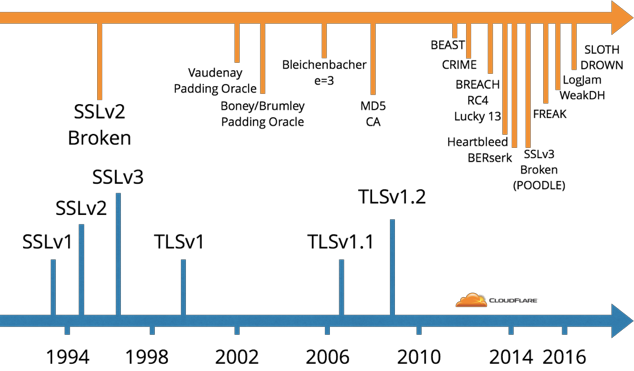
 
### TLS 1.3을 준비하는데 왜 그리 오래 걸렸을까?
  TLS 1.3을 준비하는데 걸린 시간은 4년이었는데, 그 이유는 바로 하위 호환성 때문이었습니다. 인터넷에는 컴퓨터를 비롯하여 라우터, 방화벽 등 수많은 미들웨어가 존재합니다. 이러한 미들웨어들이 제대로 TLS를 구현하지 않아서 새로운 버전을 지원하지 않는 문제가 발생했습니다. 헤더에 TLS 1.3을 의미하는 0x0304를 넣으면 기존에는 존재하지 않았던 버전이기 때문에, 잘못된 패킷이나 공격으로 감지하거나, 제대로 동작하지 않는 일이 발생한 것입니다. 이 문제를 해결하기 위해서, TLS 1.3은 기존의 버전을 나타내는 값에는 TLS 1.2와 같은 값을 사용하고, SupportedVersions라는 추가 확장을 통해서 자신이 지원하는 모든 버전을 명시하는 방식으로 변경했습니다. 왜 이런 방식으로 변경했는지에 대해서는 [Cloudflare에서 흥미롭게 다룬 글](https://blog.cloudflare.com/why-tls-1-3-isnt-in-browsers-yet/)이 있으니, 읽어보셔도 좋습니다.
  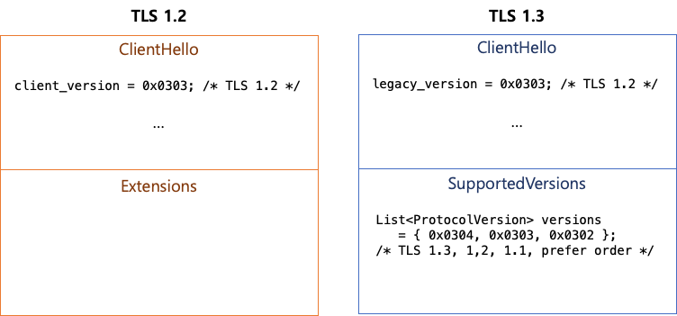

## TLS 1.3을 당장 쓸 수 있을까?

  열심히 TLS에 대해 공부했고, TLS 1.3에 대해서도 알아봤으니 이제 TLS 1.3을 사용하는 일만 남았습니다. 지금 당장 TLS 1.3을 사용할 수 있는지, 웹 브라우저와 각종 TLS 라이브러리의 지원 상황을 알아보고 서버의 TLS 1.3 설정이 올바르게 되어 있는지 테스트할 방법에 대해 간단히 알아보겠습니다.
  
### 웹 브라우저의 TLS 1.3 지원 여부

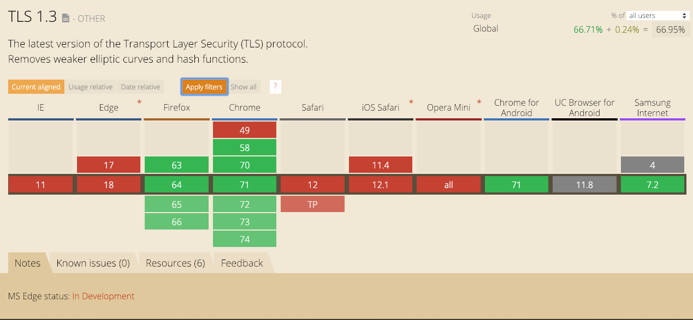
  주요 웹브라우저에 대해서 살펴보면, 2019년 1월인 현재에도 파이어폭스와 크롬, 삼성 인터넷만이 TLS 1.3을 지원하는 것을 확인할 수 있습니다. IE와 Edge, Safari, Opera 등은 아직 TLS 1.3을 지원하지 않습니다. 크롬의 경우는 chrome://flags로 들어가서 TLS 1.3 플래그를 켜야 합니다. 이 플래그를 켜고 TLS 1.3을 지원하는 서버에 접속하면 아래와 같이 TLS 1.3을 사용하는 것을 확인할 수 있습니다.
  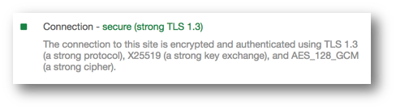

### TLS 라이브러리들의 TLS 1.3 지원 여부

아래 이미지는 주요 TLS 라이브러리의 목록을 위키피디아에서 찾은 것인데요. 제가 처음 발표자료를 준비했던 작년 9월과 비교해보니 TLS 1.3을 지원하는 라이브러리가 많이 늘었습니다.
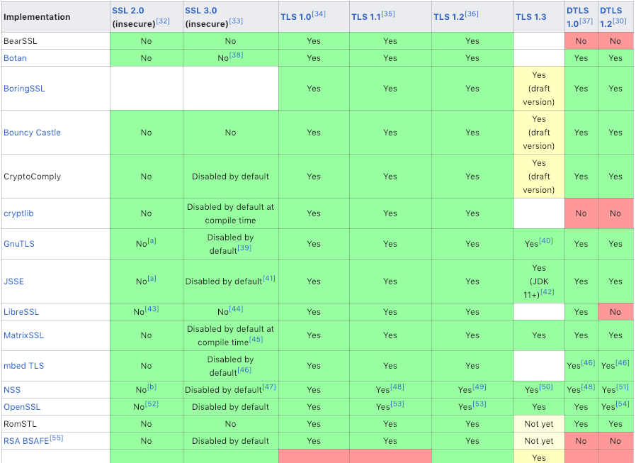

### TLS 라이브러리들의 TLS 1.3 지원 여부

우선 TLS 1.3을 지원하는 OpenSSL 1.1.1을 사용해야 합니다. apache2의 경우는 2.4.36부터, nginx는 1.13.0부터 TLS 1.3을 지원합니다. 한편, go는 TLS 1.3을 지원하는 1.12 버전이 2019년 2월 현재 beta 상태이기 때문에, 이를 기반으로 하는 Caddy는 아직 TLS 1.3을 지원하는 버전이 공식적으로 배포되지 않았습니다. Caddy에서 TLS 1.3을 사용하려면 [Caddy의 TLS 1.3 지원 이슈에 달린 이 댓글](https://github.com/mholt/caddy/issues/2080#issuecomment-439564485)에서 제안하는 대로 go의 1.12-beta 버전을 직접 빌드한 후, 패치하면 됩니다.

### TLS 1.3 테스트 방법
  [SSL Labs의 테스트](https://www.ssllabs.com/ssltest/)를 이용하면 특정 서버가 TLS 1.3을 지원하는지 확인할 수 있습니다. 아래 스크린샷은 TLS 1.3을 지원하는 Cloudflare의 블로그를 테스트한 결과입니다.
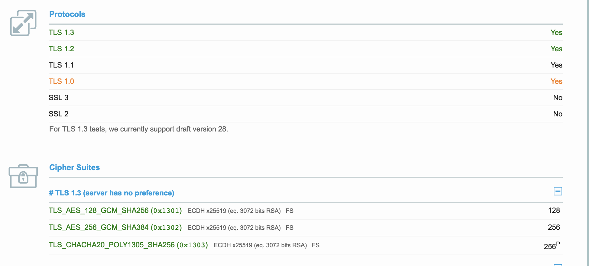

## DJB

  TLS 1.3이 선택한 변화들을 살펴보면 DJB의 업적에 대한 언급을 하지 않을 수 없습니다. Daniel Julius Bernstein 이라는 이름의 암호학자인데, 그의 몇 가지 주목할만한 업적을 살펴보면 다음과 같습니다.
* 미국 정부를 상대로 암호화 기술 수출 제한 조치에 대해 소송
* 해시 함수에 대한 DDoS 공격을 막기 위해 SipHash 공동 개발: python 3.x 등에서 사용
* 안전하고 빠른 타원 곡선 Curve25519 제안: OpenSSH에서 기본 곡선으로 사용
* 안전하고 빠른 서명 알고리즘 ed25519 개발: TLS 1.3에 추가
* 특히 모바일 기기에서 AES보다 빠른 대칭키 암호화 ChaCha20 개발: 크롬, TLS 1.3에서 사용
* IV를 가지는 MAC Poly1305 개발: TLS 1.3에서 사용

## 마치며

  이상으로 TLS가 필요한 이유부터 TLS가 제공하고자 하는 보안 목표를 살펴보고, 어떤 기법들을 이용해서 TLS가 보안 목표를 달성하는지 살펴보았습니다. TLS 1.2의 핸드셰이크를 간단히 살펴보았고, TLS 1.3에서 여러 변경된 것들을 살펴보았습니다. TLS 1.3은 안전한 기법들을 안전하게 사용할 수 있도록, 그리고 현재의 인터넷에서도 잘 동작할 수 있게 설계되었습니다. 이제는 ‘당연한 것'이 되었지만, 여전히 막연하고 어려운 것으로 생각했을 TLS를 이 글을 통해서 조금은 친해질 수 있었으면 좋겠습니다. 더 많은 사람이 TLS와 최신 버전인 TLS 1.3에 대해 이해하고 사용함으로써 인터넷이 더 안전해지기를 바랍니다.
  
참고) 이 글은 회사 내에서 발표한 발표 자료의 내용을 바탕으로 글로 읽을 때 자연스럽도록 순서를 바꾸거나, 생략하거나, 새로운 정보를 추가해서 [회사 블로그에 출판한 것](https://www.buzzvil.com/ko/2019/02/11/atech-blog-hello-tls-1-3/)을 개인 블로그에도 작성한 것입니다.

## 슬라이드와 글을 작성하는 데에 참고한 자료 모음

### 웹 브라우저의 HTTP 안전하지 않음 처리

#### 크롬

* [Emily Schechter. 2018. A milestone for Chrome security: marking HTTP as “not secure”](https://www.blog.google/products/chrome/milestone-chrome-security-marking-http-not-secure/)
* [Emily Schechter. 2018. Evolving Chrome's security indicators](https://blog.chromium.org/2018/05/evolving-chromes-security-indicators.html)

#### 파이어폭스

* [Catalin Cimpanu, 2018. Firefox Prepares to Mark All HTTP Sites "Not Secure" After HTTPS Adoption Rises](https://www.bleepingcomputer.com/news/software/firefox-prepares-to-mark-all-http-sites-not-secure-after-https-adoption-rises/)

### TLS

* [RFC2246: T. Dierks. 1999. The TLS Protocol Version 1.0](https://tools.ietf.org/html/rfc2246)
* [RFC5246: T. Dierks. 2008. The Transport Layer Security (TLS) Protocol Version 1.2](https://tools.ietf.org/html/rfc5246)
* [Agathoklis Prodromou. 2017. TLS/SSL Explained – A brief history of TLS/SSL, Part 2](https://www.acunetix.com/blog/articles/history-of-tls-ssl-part-2/)
* [Nick Sullivan. 2016. Introducing CFSSL 1.2](https://blog.cloudflare.com/introducing-cfssl-1-2/)
* [Dokydoky. 2018. HTTPS - 2. HTTPS의 Ciphersuite, Handshake, Key derivation](https://dokydoky.tistory.com/463)
* [IANA. 2005-2018. Transport Layer Security (TLS) Parameters](https://www.iana.org/assignments/tls-parameters/tls-parameters.xhtml)

### TLS 1.3

* [RFC8446: E. Rescorla. 2018. The Transport Layer Security (TLS) Protocol Version 1.3](https://tools.ietf.org/html/rfc8446)
* [Jay Thakkar. 2018. The IETF has FINALLY published TLS 1.3 as RFC 8446](https://www.thesslstore.com/blog/tls-1-3-approved/)
* [WolfSSL. 2018. TLS 1.3 Performance Part 2 – Full Handshake](https://www.wolfssl.com/tls-1-3-performance-part-2-full-handshake/)
* [Filippo Valsorda. 2016. An overview of TLS 1.3 and Q&A](https://blog.cloudflare.com/tls-1-3-overview-and-q-and-a/)
* [Nick Sullivan. 2017. Why TLS 1.3 isn't in browsers yet](https://blog.cloudflare.com/why-tls-1-3-isnt-in-browsers-yet/)
* [Nick Sullivan. 2018. A Detailed Look at RFC 8446 (a.k.a. TLS 1.3)](https://blog.cloudflare.com/rfc-8446-aka-tls-1-3/)

### 암호 기본 요소

* [SSL2Buy. Symmetric vs. Asymmetric Encryption – What are differences?](https://www.ssl2buy.com/wiki/symmetric-vs-asymmetric-encryption-what-are-differences)
* [Tim Taubert. 2016. THE EVOLUTION OF SIGNATURES IN TLS - Signature algorithms and schemes in TLS 1.0 - 1.3](https://timtaubert.de/blog/2016/07/the-evolution-of-signatures-in-tls/)
* [Cipher suite, Wikipedia](https://en.m.wikipedia.org/wiki/Cipher_suite)
* [Diffie–Hellman key exchange, Wikipedia](https://en.m.wikipedia.org/wiki/Diffie%E2%80%93Hellman_key_exchange)
* [Hash function, Wikipedia](https://en.m.wikipedia.org/wiki/Hash_function)
* [Authenticated encryption, Wikipedia](https://en.m.wikipedia.org/wiki/Authenticated_encryption)
* [EdDSA, Wikipedia](https://en.m.wikipedia.org/wiki/EdDSA)

### ChaCha

* [Elie Bursztein. 2014. Speeding up and strengthening HTTPS connections for Chrome on Android](https://security.googleblog.com/2014/04/speeding-up-and-strengthening-https.html)
* [Nick Sullivan. 2015. Do the ChaCha: better mobile performance with cryptography](https://blog.cloudflare.com/do-the-chacha-better-mobile-performance-with-cryptography/)
* [Vlad Krasnov. 2016. It takes two to ChaCha (Poly)](https://blog.cloudflare.com/it-takes-two-to-chacha-poly/)

### 타원 곡선 암호

* [Andrea Corbellini. 2015. Elliptic Curve Cryptography: a gentle introduction](https://andrea.corbellini.name/2015/05/17/elliptic-curve-cryptography-a-gentle-introduction/)
* [Andrea Corbellini. 2015. Elliptic Curve Cryptography: breaking security and a comparison with RSA](https://andrea.corbellini.name/2015/06/08/elliptic-curve-cryptography-breaking-security-and-a-comparison-with-rsa/)
* [Kelly Bresnahan. 2016. Elliptic Curve Cryptography](https://www.slideshare.net/KellyBresnahan/elliptic-curve-cryptography-66406021)
* [RFC4492: S. Blake-Wilson, et al. 2006. Elliptic Curve Cryptography (ECC) Cipher Suites for Transport Layer Security (TLS)](https://tools.ietf.org/html/rfc4492)
* [RFC8422: Y. Nir. 2018. Elliptic Curve Cryptography (ECC) Cipher Suites for Transport Layer Security (TLS) Versions 1.2 and Earlier](https://tools.ietf.org/html/rfc8422)
* [Curve25519, Wikipedia](https://en.m.wikipedia.org/wiki/Curve25519)

### TLS 1.3 지원 여부

* [Apache: Changes with Apache 2.4.36](https://github.com/apache/httpd/blob/2.4.36/CHANGES)
* [Nginx: Change Log v1.14](http://nginx.org/en/CHANGES-1.14)
* [Go: 이슈 - crypto/tls: add support for TLS 1.3](https://github.com/golang/go/issues/9671)
* [Caddy: 이슈 - TLS 1.3](https://github.com/mholt/caddy/issues/2080)

### DJB

* [Jesse Victors. 2016. TLS 1.3 and the future of cryptographic protocols](https://www.synopsys.com/blogs/software-security/tls-1-3/)
* [Daniel J. Bernstein, Wikipedia](https://en.m.wikipedia.org/wiki/Daniel_J._Bernstein)
* [Bernstein v. United States, Wikipedia](https://en.m.wikipedia.org/wiki/Bernstein_v._United_States)

### RFC 표준 문서

* [RFC2246: T. Dierks. 1999. The TLS Protocol Version 1.0](https://tools.ietf.org/html/rfc2246)
* [RFC5246: T. Dierks. 2008. The Transport Layer Security (TLS) Protocol Version 1.2](https://tools.ietf.org/html/rfc5246)
* [RFC8446: E. Rescorla. 2018. The Transport Layer Security (TLS) Protocol Version 1.3](https://tools.ietf.org/html/rfc8446)
* [RFC4492: S. Blake-Wilson, et al. 2006. Elliptic Curve Cryptography (ECC) Cipher Suites for Transport Layer Security (TLS)](https://tools.ietf.org/html/rfc4492)
* [RFC8422: Y. Nir. 2018. Elliptic Curve Cryptography (ECC) Cipher Suites for Transport Layer Security (TLS) Versions 1.2 and Earlier](https://tools.ietf.org/html/rfc8422)

### 기타

* [Transport Layer Security, Wikipedia](https://en.m.wikipedia.org/wiki/Transport_Layer_Security)
* [The Heartbleed Bug](http://heartbleed.com/)
* [Elie Bursztein. 2017. Understanding the prevalence of web traffic interception](https://blog.cloudflare.com/understanding-the-prevalence-of-web-traffic-interception/)
* [Sealpath. Protecting the three states of data](http://sealpath.com/protecting-the-three-states-of-data/)
* Jean-Philippe Aumasson 지음, 류광 옮김, 2018, Serious Cryptography 처음 배우는 암호화, 한빛미디어
