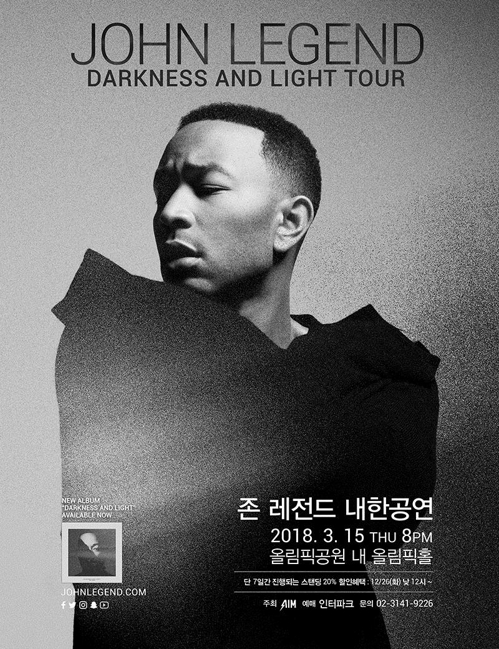
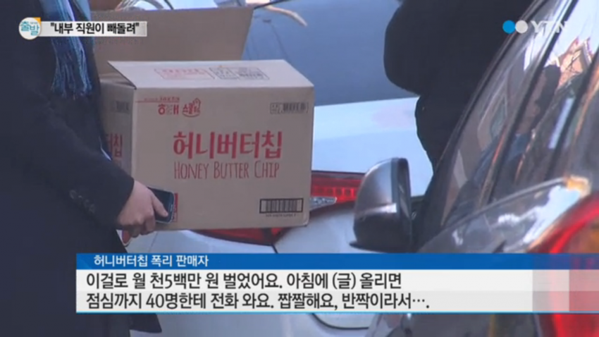
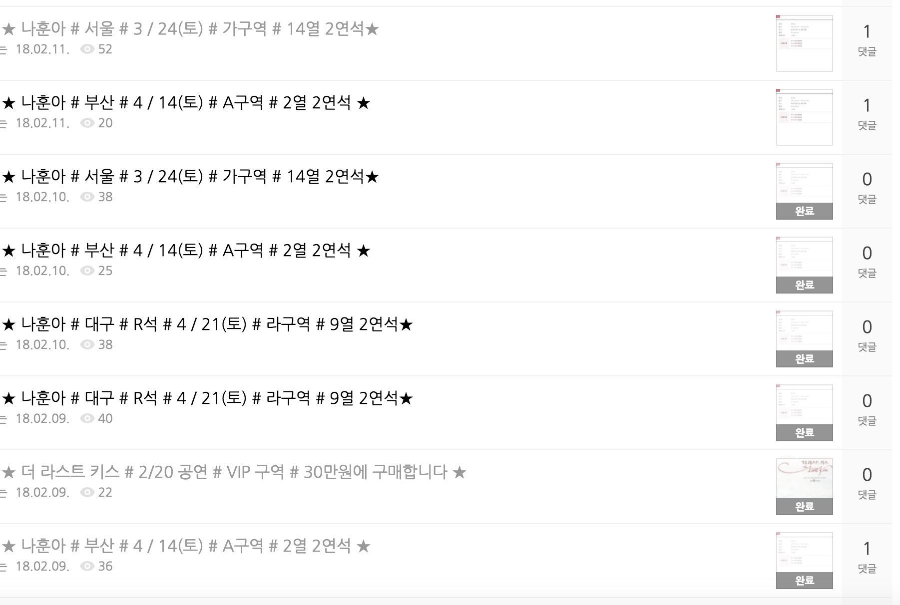
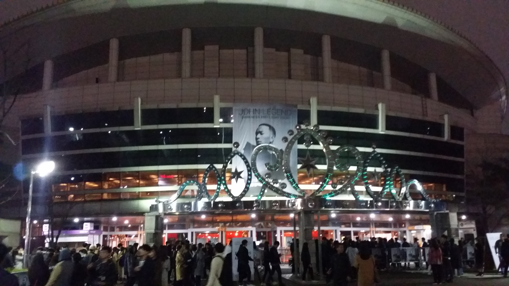

2018년 3월 14일, 회사에서 맡은 발표 준비로 잠을 조금 자고 출근하던 날이었다. 몇 번의 중고 거래로 익숙해진 중고나라를 가끔 들락이곤 했는데, 이날 아침 출근길에서도 별 생각 없이 중고나라를 들어가 보았다.

"존 레전드 공연 티켓 1장 팝니다"

존 레전드? 현지가 차에서 가끔 틀었던 음악의 가수 이름이었는데, 이름이 특이해서 기억이 났다. 현지가 이 사람 노래 잘 부르지 않냐고, 이름 값 한다고 그랬던 기억이 얼핏 나는데, 그래, 그래서 왜 이 사람의 공연 티켓을 한국에서 팔지?

찾아보니 내한 공연이 있다고 한다. 현지가 좋아하는 가수니까, 티켓팅을 시도해보려고 날짜를 찾아보니 당장 내일(3월 15일)이었다. 하루 전날이니 인터파크의 예매 페이지를 아무리 두드려도 자리가 있을 리가 없었다.

일단 쉽게 티켓을 구할 수 있는지 분위기를 좀 알아보기로 했다. 그래서 트위터에 들어가서 적당히 검색을 해봤는데, 가끔 티켓을 파는 사람들의 글들이 보였다. 그다음은 자주 가던 중고나라를 가서 게시글을 검색해서 살펴보기 시작했다. 역시 오늘도 중고로운 평화나라. 존 레전드 내한 공연의 티켓들을 어떻게들 알고 다들 구매하셔서 웃돈을 붙여서 팔고 있는 되팔렘들, '공연을 못 가게 되어서 티켓을 팔아요'라고 하면서 해외에서 글을 올리는 사기꾼들 속에서 원가에 진짜 티켓을 판매하는 진실한 티켓 판매자를 찾아야 하는 상황이었다.

상황은 그렇게 좋지 않았다. 회사에 출근하여 업무를 하고, 직원들과 소통해야 하는 바쁜 상황 속에서 중고나라에 새로운 글이 올라오는 것을 [누구보다 빠르게 난 남들과는 다르게](https://www.youtube.com/watch?v=5Qx4GGzbno8) 살펴보고 진실한 판매자인지 검증을 하고 문자를 보내고 거래를 따내는 것은 생각보다 쉽지 않은 일이었다. 특히 가장 믿음이 가는 원가 판매에 서울 직거래의 경우는 정말 순식간에 댓글이 달려서 시도할 기회조차 주어지지 않았다.

그러던 중, 한 게시물이 눈길을 끌었다. 콘서트에 가지 못하게 되어서 좌석 2개, 스탠딩 2개를 원가에 판매한다는, 하지만 대구에서 살고 있어서 등기 거래만 가능하다는 글이었다. 하지만 영상통화를 통해서 티켓 인증도 가능하니 이것저것 살펴보고 따져보고 구매하라는 내용도 덧붙여져 있었다. 중고나라에서는 무조건 직거래만 하라고는 하지만 사실 지금까지 내가 성공한 대부분의 거래는 택배 거래였다. 그래서 일단 위험성이 있음을 생각하면서, 하지만 판매자가 사기에 대한 주의를 언급한 것에 점수를 주면서 판매자의 중고나라 거래 기록을 살펴보았다.

이럴 수가. 온통 나훈아 티켓 천지이다. 딱 봐도 암표 전문 거래상의 느낌이 풀풀 풍기는 거래 내역이었다. 하지만 아쉬움이 남아서 해당 판매자의 게시글들의 댓글을 하나하나 살펴보았다. 특이한 점이 있었는데, 2개의 게시글은 티켓을 구매한다는 글이었고, 연락처와 거주지는 모두 일정했다는 점이었다. 호기심이 일기 시작했고, 머릿속에서는 저울질하기 시작했다. 사기당할 위험을 고려하고 투자할만한 가치가 있을까? 현지가 존 레전드를 엄청 좋아했던 것 같은데, 우리가 어디 해외여행을 나가서 마침 존 레전드가 거기서 공연을 해서 그 공연의 티켓 예매에 성공해서 공연을 보게 될 가능성이 얼마나 될까? 이 사람이 한국에 직접 온다고 하는데, 이 기회가 그렇게 흔할까? 여러 고민을 한 끝에 발을 담가보기로 했다.

"존 레전드 a2 2연석 티켓 팔렸나요?"

보통의 거래는 인사를 먼저 하고 시작하곤 했는데, 급한 나머지 저것부터 보냈다. 다행히 티켓은 판매 중이었고, 다른 사람들도 나와 비슷한 생각을 했는지 티켓이 생각보다 빨리 팔리지는 않는 것 같았다.

좋아 그러면 일단 거래의 문을 열었는데, 무엇부터 해야 하지? 내가 무엇부터 해야 이 거래에 대해 믿음을 가질 수 있고, 또 문제가 생겼을 때 처리를 할 방법을 열어둘 수 있을까? "네가 누구냐"부터 시작하는 게 좋을 것 같았다.

"안녕하세요ㅎㅎ 혹시 판매하시는 분에 대한 인증이 가능하실까요?"

3분 뒤, 대학원 학생증과 비자 카드의 이름 부분이 있는 사진이 날아왔다. 생각보다 행동이 적극적이어서 오히려 내가 당황했지만, 침착하게 상황을 살펴보았다. 두 장의 카드의 이름은 같았고, 상대방이 어떤 신원인지도 파악할 수 있었지만, 이 이름을 가진 사람이 지금 내가 연락하는 사람이라는 보장은 없었다.

그래서 내가 거래 내역이 티켓뿐이라 신뢰가 잘 안된다고 하자 바로 영상통화를 해서 실물을 확인하자고 하는 상대방. 생각해보니 당장 공연은 내일이라 거래는 빠르면 빠를수록 좋았고, 만약 내가 입금하는 계좌의 이름이 이 사람이 보낸 신분증의 이름과 같다면 어느 정도 믿을만하다는 생각이 들었다. 지갑을 통째로 훔치거나 주울 수는 있어도 계좌에 대한 거래 권한까지 훔치기는 쉽지 않을 테니까.

바로 계좌 정보를 달라고 했고, 이름이 일치하는 것을 확인한 후 바로 입금을 완료했다. 그러자 상대방에게서 연락이 와서, '우선 등기로 보낼 것이고 내일 도착을 목표로 할 텐데 도착이 어려울 수 있다. 그러면 근처 우체국에 연락해서 직접 찾으면 아마 더 빠르게 받을 수 있을 것이다, 4시쯤 우체국에 가서 보낼 예정이다'라는 말들을 들었다.

하지만 여기에서도 사실 여러 가지 단계에서 사기가 가능할 것 같았고 그래서 안심할 수는 없었다. 예를 들어서 티켓이 아닌 종이 쪼가리를 보낼 수도 있고, 진짜 티켓을 내가 적은 주소가 아닌 엉뚱한 곳으로 보내버릴 수도 있고, 티켓을 잘 위조해서 가짜 티켓을 보낼 수도 있지 않을까?

그래서 현지한테는 티켓을 받을 때까지 비밀로 하려고 했었는데, 판매자의 행동들이 점점 믿음이 가다 보니 참을 수가 없어서 결국 말을 꺼냈다. 예상했던 대로 이 말을 들은 현지는 일이 손에 안잡힌다며, 오늘 하루 종일 존레전드 노래만 들을거라며 들떴고, 나는 혹시라도 사기면 어떻게 하지라는 걱정이 계속 있었다.

그래서 결말은 어떻게 됐냐고?

전설을 만나고 왔습니다.
